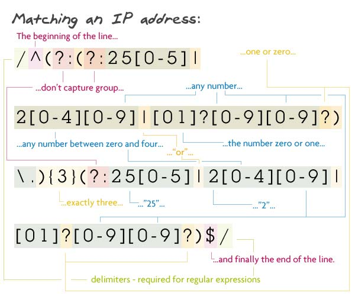

# Internet Protocol (IP) Regular Expressions 

A regular expression (regex or regexp for short) is a special text string for describing a search pattern. You can think of regular expressions as wildcards on steroids. You are probably familiar with wildcard notations such as *.txt to find all text files in a file manager. The regex equivalent is `^.*\.txt$`.

But you can do much more with regular expressions. In a text editor like EditPad Pro or a specialized text processing tool like PowerGREP, you could use the regular expression `\b[A-Z0-9._%+-]+@[A-Z0-9.-]+\.[A-Z]{2,}\b` to search for an email address. Any email address, to be exact. A very similar regular expression (replace the first \b with ^ and the last one with $) can be used by a programmer to check whether the user entered a properly formatted email address. In just one line of code, whether that code is written in `Perl`, `PHP`, `Java`, a `.NET` language, or a `multitude of other languages`.

## Summary

An `IP address` is a `unique address` that identifies a device on the internet or a local network. IP stands for "Internet Protocol," which is the set of rules governing the format of data sent via the internet or local network.

Matching IP address: `/^(?:(?:25[0-5]|2[0-4][0-9]|[01]?[0-9][0-9]?)\.){3}(?:25[0-5]|2[0-4][0-9]|[01]?[0-9][0-9]?)$/`

## Table of Contents

- [Anchors](#anchors)
- [Quantifiers](#quantifiers)
- [Grouping Constructs](#grouping-constructs)
- [Bracket Expressions](#bracket-expressions)
- [Character Classes](#character-classes)
- [The OR Operator](#the-or-operator)
- [Flags](#flags)
- [Character Escapes](#character-escapes)

## Regex Components

A regex is considered a literal, so the pattern must be wrapped in slash characters `/`. If we examine the “Matching a IP address” regex, you'll see that this is true: 

`/^(?:(?:25[0-5]|2[0-4][0-9]|[01]?[0-9][0-9]?)\.){3}(?:25[0-5]|2[0-4][0-9]|[01]?[0-9][0-9]?)$/`

#### IP address Brakdowne

`/^(?:(?:25[0-5]|2[0-4][0-9]|[?01][0-9][?0-9])\.){3}(?:25[0-5]|2[0-4][0-9]|[?01][0-9][?0-9])$/`

`^` asserts position at start of the string

Non-capturing group `(?:(?:25[0-5]|2[0-4][0-9]|[?01][0-9][?0-9])\.){3}`

`{3}` matches the previous token exactly 3 times

Non-capturing group `(?:25[0-5]|2[0-4][0-9]|[?01][0-9][?0-9])`

### 1st Alternative `25[0-5]`
25 matches the characters 25 literally
Match a single character present in the list below `[0-5]`
0-5 matches a single character in the range between 0 (index 48) and 5 (index 53) 
### 2nd Alternative `2[0-4][0-9]`
2 matches the character 2 literally 
Match a single character present in the list below `[0-4]`
0-4 matches a single character in the range between 0 (index 48) and 4 (index 52) 
Match a single character present in the list below `[0-9]`
### 3rd Alternative `[?01][0-9][?0-9]`
Match a single character present in the list below `[01]`
`?` matches the previous token between zero and one times, as many times as possible, giving back as needed (greedy)
01 matches a single character in the list 01 
Match a single character present in the list below `[0-9]`
0-9 matches a single character in the range between 0 (index 48) and 9 (index 57) 
Match a single character present in the list below `[0-9]`
`?` matches the previous token between zero and one times, as many times as possible, giving back as needed (greedy)
0-9 matches a single character in the range between 0 (index 48) and 9 (index 57)  `\.` matches the character . literally (case sensitive)
Non-capturing group (`?:25[0-5]|2[0-4][0-9]|[?01][0-9][?0-9])`
`$` asserts position at the end of the string, or before the line terminator right at the end of the string 

### Anchors
The characters `^` and `$`are both considered to be `anchors`.

### Quantifiers

Quantifiers are inherently greedy, meaning they match as many occurrences of particular patterns as possible. They include the following:

    * —Matches the pattern zero or more times

    + —Matches the pattern one or more times

    ? —Matches the pattern zero or one time

    {} —Curly brackets can provide three different ways to set limits for a match:

    { n } —Matches the pattern exactly n number of times

    { n, } —Matches the pattern at least n number of times

    { n, x } —Matches the pattern from a minimum of n number of times to a maximum of x number of times

Each of these quantifiers can be made lazy by adding the `?` symbol after it, meaning it will match as few occurrences as possible.
In ur example we used `{ n }`: 
`{3}(?:25[0-5]|2[0-4][0-9]|[01]?[0-9][0-9]?)`

### Grouping Constructs

The primary way you group a section of a regex is by using parentheses `()`. Each section within parentheses is known as a subexpression.
The following example contains two grouping constructs or subexpressions:
`(?:25[0-5]|2[0-4][0-9]|[01]?[0-9][0-9]?)`

### Bracket Expressions

Anything inside a set of square brackets `[]` represents a range of characters that we want to match.
The following example contains breket :
`25[0-5]|2[0-4][0-9]`
### Character Classes

A character class in a regex defines a set of characters, any one of which can occur in an input string to fulfill a match. We've actually already discussed some character classes. The bracket expressions outlined previously, including positive and negative character groups, are considered character classes.

### The OR Operator

Using the OR operator `|`, the expression [abc] could be written as (a|b|c). Using our example in the grouping constructs section, we can take the original expression:
`25[0-5]|2[0-4]`

### Flags

We started this tutorial by explaining that as a literal, a regex must be wrapped in slash characters. The one exception to this rule is with the component known as flags. Flags are placed at the end of a regex, after the second slash, and they define additional functionality or limits for the regex

### Character Escapes

The backslash `\` in a regex escapes a character that otherwise would be interpreted literally. For example, the open curly brace `{` is used to begin a quantifier, but adding a backslash before the open curly brace `\{` means that the regex should look for the open curly brace character instead of beginning to define a quantifier. This is common when looking for strings with special characters that are the same as a particular component of a regex.

## Author

###Ahmed A. Hakeem 
[Github Profile](https://github.com/hakeem235) | [Portfolio](https://hakeem235.github.io/Professional-Portfolio-Vol2/)

##Resources
* [regex tutorial](https://coding-boot-camp.github.io/full-stack/computer-science/regex-tutorial)
* [regex validator](https://regex101.com/)
